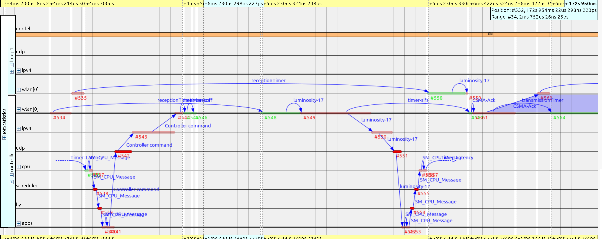

# Simcan2Fog
<div align="center">

  

  
  
  
  

</div>

## Overview
The purpose of this project is to build a customizable simulator for cloud, edge and fog environements. It is based on the Simcan2Cloud simulator.

### Roadmap
Present objectives: further explaining the code base, experiments and showcases.    
Future objectives: containerizing the simulator.

## Table of contents

* [Installation](#installation)
* [Quick Start](#quick-start)
* [Simulating][usage]
* [Testing][testing]
* [Documentation](#documentation)
* [Extensions](#extensions)
* [Acknowledgements](#acknowledgements)

[design]: docs/design.md
[usage]: docs/usage.md
[testing]: docs/testing.md

## Installation
Here are some high level instructions on how to install the simultator.

### Dependencies
As of today, Simcan2Fog relies on:
* **OMNeT++ 6.3.0** : The development framework and simulation kernel.
* **INET4 4.5.4**: The OMNeT++ networking models library and framework.

### Installing the project

#### Installing OMNeT
1. Head to https://omnetpp.org/download/old.html and download OMNeT++ 6.3.0 with the IDE (not the core version). There's variety of architectures and operating systems.
2. Decompress the file in your user directory
3. Follow the steps included in ```doc/InstallGuide.pdf``` in order to complete the installation.
> Also check out the InstallGuide of the later version (available at: https://doc.omnetpp.org/omnetpp/InstallGuide.pdf) for newer development environements (like Ubuntu 22.04 LTS or 24.04 LTS)

After the installation is complete you can run the examples provided by OMNeT++. 
> Watch out for those who need extra dependencies like OpenSceneGraph and OsgEarth.  
A safe option would be the **Tic Toc** examples.

#### Installing INET4
The easiest way to install this framework is from the IDE wizard:
1. Head to `Help > Install Simulation Models`
2. Click on `INET Framework 4`, let the default path and click on `Install Proyect`

After the installation is complete you can run a tutorial, example or showcase provided by INET to verify that everything is working correctly.

#### Installing Simcan2Fog
1. Clone the repo inside the ```omnetpp-6.3.0``` installation folder
2. Add the environment variables into your ```.bashrc```

At this point your ```.bashrc``` (or shell equivalent) should have a section like this:
```
# These statements load into the session the environment variables
[ -f "$HOME/omnetpp-6.3.0/setenv" ] && source "$HOME/omnetpp-6.3.0/setenv" -q
[ -f "$HOME/omnetpp-6.3.0/inet4.5/setenv" ] && source "$HOME/omnetpp-6.3.0/inet4.5/setenv" -q
[ -f "$HOME/omnetpp-6.3.0/Simcan2Fog/setenv" ] && source "$HOME/omnetpp-6.3.0/Simcan2Fog/setenv" -q
```

2. Open the OMNeT++ IDE and select **build proyect**

Technically it should build without any trouble from this point on.
If the build succeded, congratulations! You can now move forward to [running experiments](./docs/usage.md).

## Quick Start
Start navigating and exploring with the showcases included in the folder ```showcases/```:
+ **Datacentre**: Shows how an user may request a cloud vm, deploy an service and even how to instruct the model to deploy a local application that will communicate with the previous service.
+ **IoT**: Introduces a quick configuration and topology for the IoT models. In this case a smart house is being modelled.
+ **Proxy**: Dives into a key component of the simulation framework, the Proxy module. Here you will have the choice to include DNS into the mix or not.
+ **Statistics**: Demonstrates how to configure a simulation for statistical and event capture. Also the secuence chart can be generated to see the 
different interactions (see below picture).
<div align="center">
  
</div>

## Documentation
A useful reference for model development and usage is the NED documentation which is currently being hosted at https://ulyssesdeaguilar.github.io/s2f-ned-docs/

Coming soon is the C++ model API documentation.

## Extensions
Currently there's a fork of this proyect, Simcan2Chain by Tommy (check it out here: https://github.com/eltaters/simcan2chain), that has backported enhancements for the DNS module and extra features. In order to not break the current users installations there is now a feature flag named Simcan2Chain, disabled by default, that makes optional the dependencies for the extra features of said proyect.

If one wants to enable the Simcan2Chain P2P and cryptology features:
1. Right click on the Simcan2Fog proyect
2. Go to "Properties"
3. In the new menu go to "OMNeT++" > "Proyect features"
4. Enable the checkbox for "Simcan2Chain dependencies"
5. Click on "Apply" or "Apply and close"
6. Clean and recompile the proyect

## Citation

If you use **Simcan2Fog** in your research, please cite the following paper published in *SoftwareX*:

**BibTeX:**
```bibtex
@article{deaguilar2025,
  title = {Simcan2Fog: A discrete-event platform for the modelling and simulation of Fog computing environments},
  journal = {SoftwareX},
  volume = {32},
  pages = {102424},
  year = {2025},
  issn = {2352-7110},
  doi = {10.1016/j.softx.2025.102424},
  url = {https://doi.org/10.1016/j.softx.2025.102424},
  author = {Ulysses {de Aguilar} and Pablo C. Cañizares and Alberto Núñez}
}

## Acknowledgements
Special thanks to the following authors for the different custom icons included in the simulator:

+ <a href="https://www.flaticon.com/free-icons/data-center" title="data center icons">Data center icons created by smashingstocks - Flaticon</a>
+ <a href="https://www.flaticon.com/free-icons/dns" title="dns icons">Dns icons created by Freepik - Flaticon</a>
+ <a href="https://www.freepik.com/free-vector/isometric-housing-collection_3327432.htm#fromView=search&page=1&position=49&uuid=7d5d5a3a-c4c3-4e0d-80f2-f18f719eca65" title="dns icons">Designed by Freepik (iso houses)</a>
