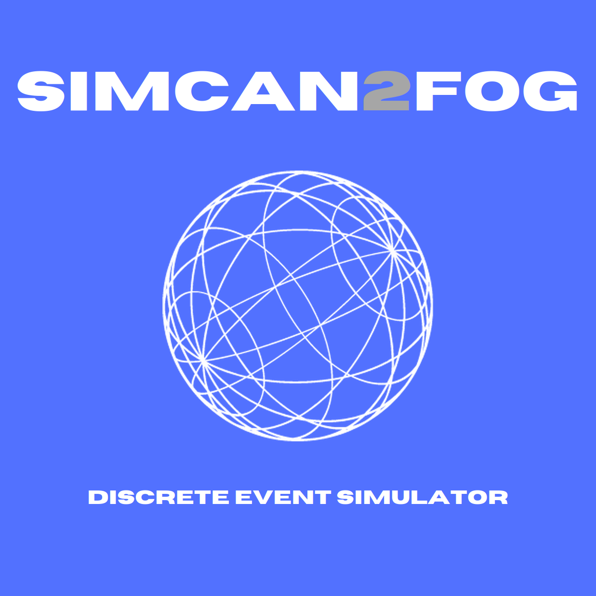

# Simcan2Fog
<div align="center">

  

  
  
  
  

</div>

## Overview
The purpose of this project is to build a customizable simulator for cloud, edge and fog environements. It is based on the Simcan2Cloud Simulator.

### Roadmap
Present objectives: explaining the code base, experiments and showcases.  
Next objectives: Moving towards the latest OMNeT++ version (6.1.0)   
Future objectives: containerizing the simulator.
## Table of contents

* [Installation](#installation)
* [Quick Start](#quickstart)
* [Design][design]
* [Simulating][execution]
* [Testing][testing]
* [Acknowledgements][#acknowledgements]
[design]: docs/design.md
[execution]: docs/execution.md
[testing]: docs/testing.md

## Installation
Here are some high level instructions on how to install the simultator.

### Dependencies
As of today, Simcan2Fog relies on:
* **OMNeT++ 6.0.3** : The development framework and simulation kernel.
* **INET4 4.5.2**: The OMNeT++ networking models library and framework.

### Installing the project

#### Installing OMNeT
1. Head to https://omnetpp.org/download/old.html and download OMNeT++ 6.0.3 with the IDE (not the core version). There's variety of architectures and operating systems.
2. Decompress the file in your user directory
3. Follow the steps included in ```doc/InstallGuide.pdf``` in order to complete the installation.
> Also check out the InstallGuide of the later version (available at: https://doc.omnetpp.org/omnetpp/InstallGuide.pdf) for newer development environements (like Ubuntu 22.04 LTS or 24.04 LTS)

After the installation is complete you can run the examples provided by OMNeT++. 
> Watch out for those who need extra dependencies like OpenSceneGraph and OsgEarth.  
A safe option would be the **Tic Toc** examples.

#### Installing INET4
The easiest way to install this framework is from the IDE wizard:
1. Head to `Help > Install Simulation Models`
2. Click on `INET Framework 4`, let the default path and click on `Install Proyect`

After the installation is complete you can run a tutorial, example or showcase provided by INET to verify that everything is working correctly.

#### Installing Simcan2Fog
1. Clone the repo inside the ```omnetpp-6.0.3``` folder
2. Open the OMNeT++ IDE and select **build proyect**

Technically it should build without any trouble from this point on. 
If the build succeded, congratulations! You can now move forward to [running experiments](./docs/usage.md).

## Quick Start
When the simulator is ready (or at least mostly ready) we will list here some scenarios that you'll be able to run once you finished installing the software.

## Acknowledgements
Special thanks to the following authors for the different custom icons included in the simulator:

+ <a href="https://www.flaticon.com/free-icons/data-center" title="data center icons">Data center icons created by smashingstocks - Flaticon</a>
+ <a href="https://www.flaticon.com/free-icons/dns" title="dns icons">Dns icons created by Freepik - Flaticon</a>
+ <a href="https://www.freepik.com/free-vector/isometric-housing-collection_3327432.htm#fromView=search&page=1&position=49&uuid=7d5d5a3a-c4c3-4e0d-80f2-f18f719eca65" title="dns icons">Designed by Freepik (iso houses)</a>